# NewsMailAgent 📰✉️

## 系统网页效果展示

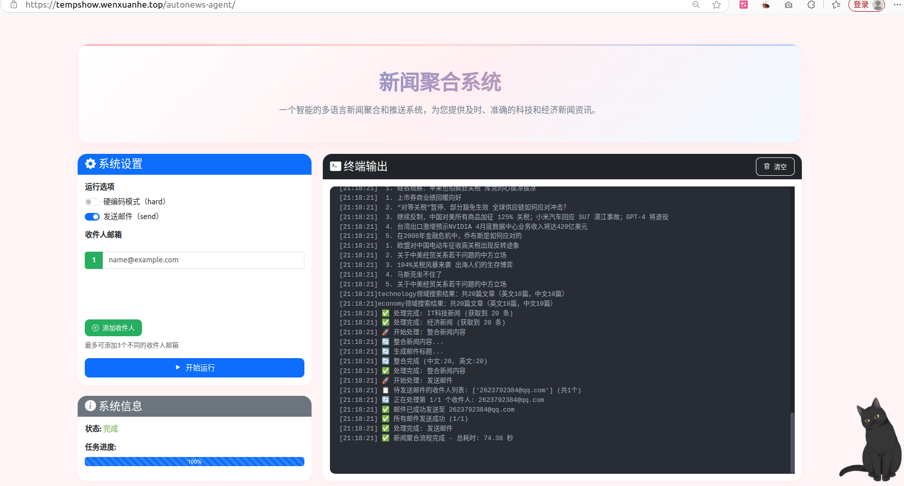

> 系统网页效果截图，网页已部署：[https://tempshow.wenxuanhe.top/autonews-agent/](https://tempshow.wenxuanhe.top/autonews-agent/)

## 功能概述 🌟

- 🔍 自动收集技术、经济和生物学领域的最新新闻
- 🌐 支持中英文双语新闻搜索与处理
- 🧠 基于LLM的文章筛选与内容相关性评估
- 📊 自动整合多领域新闻内容，生成结构化简报
- 📧 邮件自动分发系统，支持多收件人
- ⏰ 支持定时调度执行

## 实现原理 🏗️

本系统采用多智能体协作架构，结合NewsAPI新闻检索、LangChain智能体编排与自建GPT-4o-mini大模型网关，实现高效、智能的新闻聚合与分发。

### 系统架构与流程

本系统由三大核心智能体协作完成：

1. **新闻检索智能体**
   - 基于LangChain框架，调用自建GPT-4o-mini大模型（通过自有API网关）动态生成技术、经济、生物学等领域的中英文关键词。
   - 大模型结合领域特定提示词，从`agents/keywords.json`文件中筛选或扩展高相关性关键词，生成用于新闻检索的关键词组合。
   - 利用上述关键词组合，自动调用NewsAPI检索最新新闻，支持多语言、多领域并行检索，提升信息覆盖面。

2. **内容整合与筛选智能体**
   - 对检索到的新闻进行去重、聚合与结构化处理。
   - 基于大模型对新闻内容进行相关性、代表性评估，筛选高价值信息，确保结果多样且有代表性。

3. **邮件分发智能体**
   - 自动生成结构化新闻简报与邮件标题。
   - 从`.env`文件中读取`EMAIL_RECEIVER`字段，作为收件人邮箱地址（如有多个邮箱请用空格分隔）。
   - 将整合后的结果发送至配置的收件人邮箱，支持多收件人和定时调度。

> 所有智能体涉及的自然语言理解、内容生成、筛选等任务，均通过自建GPT-4o-mini网关完成。

---

### 依赖工具说明

#### 1. NewsAPI Key 获取方式

- 访问 [https://newsapi.org/](https://newsapi.org/)
- 注册账号后，进入控制台获取你的 API Key
- 在`.env`文件中配置：
  ```
  NEWS_API_KEY=your_news_api_key_here
  ```
- NewsAPI 免费额度有限，建议关注官方说明

#### 2. CQUSERVICE网关API调用说明

本项目集成了自建的GPT-4o-mini大模型API网关，所有LLM相关任务均通过如下接口调用：

- **接口地址**：`https://chat.cquservice.top/v1/chat/completions`
- **请求方式**：POST

| 参数/字段         | 类型     | 必填 | 说明                                                         |
|------------------|----------|------|--------------------------------------------------------------|
| Authorization    | string   | 是   | Bearer Token，放在请求头，支持多种Token类型                  |
| model            | string   | 是   | 模型名称，填`gpt-4o-mini`                                    |
| messages         | array    | 是   | 对话消息，格式同OpenAI标准                                   |
| temperature      | float    | 否   | 采样温度，控制生成多样性                                     |
| ...              | ...      | 否   | 其他OpenAI兼容参数                                           |

- **请求体示例**：

```json
{
  "model": "gpt-4o-mini",
  "messages": [
    {"role": "system", "content": "你是一个新闻聚合助手..."},
    {"role": "user", "content": "请帮我生成技术领域的关键词"}
  ],
  "temperature": 0.7
}
```

- **返回体示例**：

```json
{
  "id": "chatcmpl-xxx",
  "object": "chat.completion",
  "created": 1710000000,
  "model": "gpt-4o-mini",
  "choices": [
    {
      "index": 0,
      "message": {"role": "assistant", "content": "技术, AI, 机器学习, ..."},
      "finish_reason": "stop"
    }
  ],
  "usage": {"prompt_tokens": 30, "completion_tokens": 10, "total_tokens": 40}
}
```

- **注意事项**：
  - `Authorization`头必须携带有效Token。
  - 支持标准OpenAI兼容参数，详见[OpenAI官方文档](https://platform.openai.com/docs/api-reference/chat/create)。
  - 推荐结合LangChain等框架进行多轮对话与智能体编排。

---

## 项目结构 📁

```
/
├── agents/                # 智能代理模块
│   ├── base_agent.py     # 基础代理类
│   ├── search_agent.py   # 搜索代理
│   ├── integration_agent.py # 内容整合代理
│   ├── email_agent.py    # 邮件分发代理
│   └── keywords.json     # 关键词数据库
├── main.py               # 程序入口
├── .env.example          # 环境变量模板
├── .env                  # 环境变量配置（需自行创建）
└── requirements.txt      # 项目依赖
```

## 环境配置 🛠️

### 依赖安装 📦

```bash
pip install -r requirements.txt
```

### 环境变量配置 ⚙️

复制环境变量模板文件：

```bash
cp .env.example .env
```

配置`.env`文件内容：

```
# API配置
NEWS_API_KEY=your_news_api_key_here
OPENAI_API_KEY=your_openai_api_key_here

# 邮件服务配置
EMAIL_SENDER=your_email@example.com
EMAIL_PASSWORD=your_email_password
EMAIL_RECEIVER=recipient1@example.com,recipient2@example.com,2563374153@qq.com
SMTP_SERVER=smtp.example.com
SMTP_PORT=587

# 调度配置
SCHEDULE_TIME=07:00
```

配置说明：
- 🔑 `NEWS_API_KEY`: NewsAPI接口密钥
- 🔑 `OPENAI_API_KEY`: OpenAI API密钥，用于内容生成与筛选
- 📨 `EMAIL_SENDER`: 发送邮箱地址
- 🔒 `EMAIL_PASSWORD`: 发送邮箱密码或应用专用密码
- 📩 `EMAIL_RECEIVER`: 接收邮箱地址，多个地址用逗号分隔
- 🖥️ `SMTP_SERVER`: SMTP服务器地址
- 🔌 `SMTP_PORT`: SMTP服务器端口
- 🕗 `SCHEDULE_TIME`: 定时执行时间(HH:MM格式)

## 使用方法 📋

### 标准模式 🚀

```bash
python main.py
```

启动完整的新闻聚合流程，包括LLM关键词生成、新闻检索、内容整合及邮件分发。

### 预设关键词模式 🔍

```bash
python main.py --hard=true
```

使用系统预设的关键词组合进行搜索，输出详细的检索结果，便于调试和验证。此模式仍执行完整的内容整合和邮件分发流程。

### 邮件测试模式 📧

```bash
python main.py --sent=false
```

仅执行新闻收集和内容整合流程，但不发送邮件，适用于开发和测试阶段。

参数说明：
- 🔄 `--hard=true`: 启用预设关键词组合并输出详细检索结果
- 📧 `--sent=false`: 禁用邮件发送功能，仅执行新闻收集和内容整合


## 高级配置 🔧

### 关键词定制 🔤

通过修改`agents/keywords.json`文件可自定义各领域的预设关键词库，系统将基于此生成搜索查询组合。

### 领域提示词配置 🎯

`search_agent.py`中的`domain_prompts`字典定义了各领域的文章筛选标准，可根据需求调整筛选参数和权重。


## 故障排查 ❓

API密钥错误：
- 检查`.env`文件配置及环境变量加载状态

搜索结果质量问题：
- 使用`--hard=true`参数运行进行结果验证
- 审查并优化`keywords.json`中的关键词配置
- 调整`search_agent.py`中的领域筛选参数


## 进阶部分：大模型微调与标题分类准确率提升 🧬

### 背景与挑战

在实际应用中，NewsAPI基于关键词检索新闻时，常常出现领域混淆现象。例如，检索"生物"相关新闻时，返回结果中常混入AI、经济等无关领域的内容。这种噪声极大影响了下游新闻聚合与推送的准确性。因此，我们聚焦于**新闻标题的自动分类与领域判别**，以提升整体系统的相关性和智能性。

### 技术路线与实现原理

本部分基于**DeepSeek-R1-Distill-Qwen-14B**大模型，结合LORA参数高效微调方法，构建了一个高精度的新闻标题分类器。整体流程如下：

### 实验平台

本项目实验平台硬件环境如下：

- 服务器配备8张NVIDIA A800 80G显卡，CPU及内存信息如下：

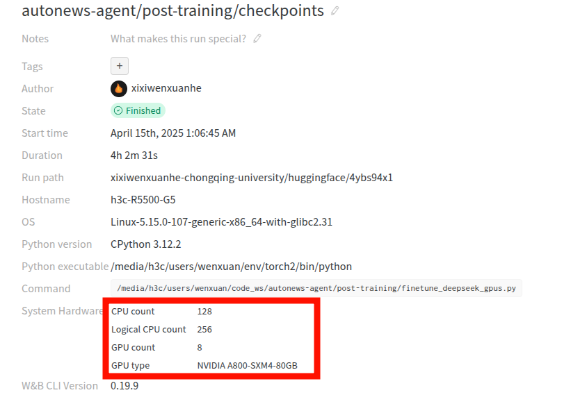

- 本次实验仅用2张A800进行分布式微调：

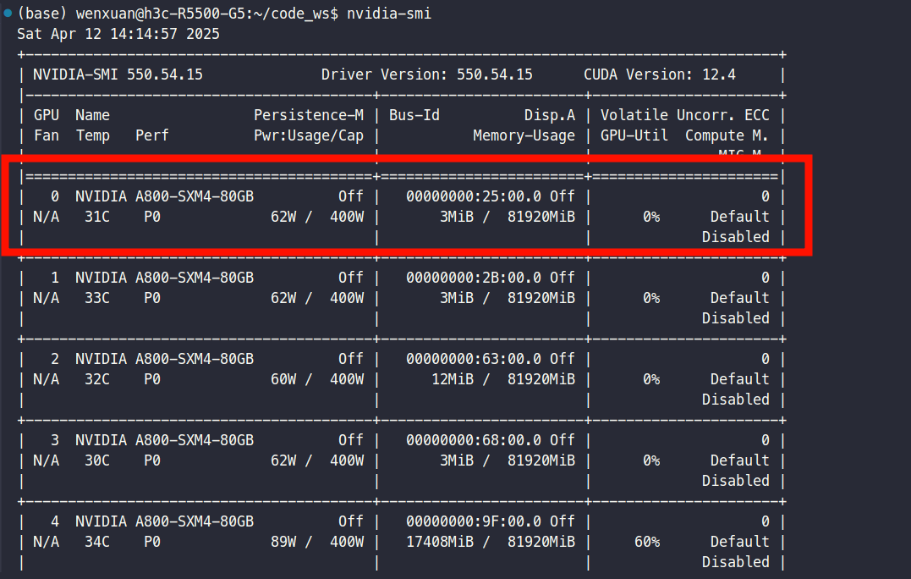

1. **数据采集与预处理**
   - 使用`utils/news_fetch.py`自动抓取多领域新闻标题，存储于`dataset/`目录下。
   - 通过`utils/news_title_classifier.py`，调用自建GPT-4o-mini网关，对采集到的标题进行领域标签标注，形成高质量有标签数据集。
   - 利用`utils/prepare_fine_tuning_data.py`，将标注后的数据转换为适配大模型微调的数据格式（如jsonl），便于后续训练。

2. **大模型微调**
   - 单卡微调：使用`finetune_deepseek.py`，基于LORA方法对DeepSeek-R1-Distill-Qwen-14B进行高效微调。
   - 多卡分布式微调：通过`finetune_deepseek_gpus.py`，支持多GPU环境下的分布式训练，加速大规模数据处理。
   - 微调数据均来源于`dataset/`目录下的高质量标注集。

3. **API服务与测试**
   - `api_server.py`：提供原始DeepSeek-R1-Distill-Qwen-14B模型的本地API服务，便于推理与对比测试。
   - `api_server_ft.py`：部署微调后的模型API服务，支持外部调用与评估。
   - `curl.py`：包含一系列API测试脚本，用于验证网关服务的可用性与响应准确性。

4. **效果评估与对比**
   - `extract_inference_dataset.py`：从带标签数据集中提取标题及标准答案，构建评测集。
   - `inference_evaluation.py`与`inference_evaluation_ft.py`：分别对原始模型与微调模型进行推理测试，统计各自的标题分类准确率，量化微调效果。

### 目录结构

```
.post-training
├── api_server_ft.py           # 微调后模型的API服务
├── api_server.py              # 原始模型的API服务
├── curl.py                    # API测试脚本，验证网关可用性
├── dataset                    # 数据集目录
│   ├── inference.json             # 推理评测用数据
│   ├── inference_train.json       # 推理训练用数据
│   ├── news_titles_20250414.txt   # 抓取的原始新闻标题
│   ├── processed_titles_20250414.json # 处理后的带标签标题
│   ├── train.jsonl                # 微调训练集
│   └── val.jsonl                  # 微调验证集
├── extract_inference_dataset.py   # 构建推理评测集脚本
├── finetune_deepseek_gpus.py      # 多GPU分布式微调脚本
├── finetune_deepseek.py           # 单GPU微调脚本
├── inference_evaluation_ft.py     # 微调后模型的推理评测
├── inference_evaluation.py        # 原始模型的推理评测
├── logs
│   └── imgs                       # 训练/评测过程图片
├── utils
│   ├── news_fetch.py              # 新闻标题抓取脚本
│   ├── news_title_classifier.py   # 标题自动打标签脚本
│   └── prepare_fine_tuning_data.py# 标注数据转微调格式脚本
└── wandb                          # 训练日志与可视化
    ├── latest-run -> run-20250415_010644-4ybs94x1
    ├── run-20250414_190944-ot0jrwum
    ├── run-20250414_191602-hswcei9x
    └── run-20250415_010644-4ybs94x1
```

### CookTricks

#### 智能化标签生成与类别均衡机制
本项目在数据预处理阶段引入了智能化标签生成与类别均衡机制。`news_title_classifier.py`不仅实现了对新闻标题的自动化领域判别，还能基于当前类别分布动态生成补充样本，从而有效缓解类别不均衡问题。这一机制提升了训练数据的代表性与公平性，显著增强了模型在少数类上的泛化能力。最终生成的`processed_titles_20250414.json`文件，既包含真实采集的标题，也包含AI生成的均衡补充样本，并通过`is_generated`字段加以区分，便于后续灵活筛选与分析。

#### 分布式并行训练架构
模型训练部分采用了分布式并行训练架构，支持单机多卡环境下的高效微调。通过`finetune_deepseek_gpus.py`脚本与PyTorch DDP（Distributed Data Parallel）机制，用户仅需一行命令即可充分利用多GPU资源，大幅缩短训练周期。该架构不仅提升了当前实验效率，也为未来大规模、多任务、多领域的大模型训练提供了坚实的工程基础。

```bash
torchrun --nproc_per_node=2 autonews-agent/post-training/finetune_deepseek_gpus.py
```

#### LoRA参数高效微调方法
本项目微调环节采用了LoRA（Low-Rank Adaptation）参数高效微调方法。LoRA通过对部分权重矩阵引入低秩分解，仅训练极少量的可学习参数，极大降低了显存与算力消耗。其核心思想可表述为：

$$
W = W_0 + \Delta W = W_0 + BA
$$

其中，

$$
A \in \mathbb{R}^{r \times d}
$$

$$
B \in \mathbb{R}^{d \times r}
$$

$$
r \ll d
$$

仅需训练低秩矩阵 A、B，即可实现对大模型的高效适配。LoRA 方法不仅适用于资源受限环境下的大模型微调，也天然契合分布式并行训练场景，助力大规模应用落地。

### DevFlow

#### 1. 运行news_title_classifier.py后的截图
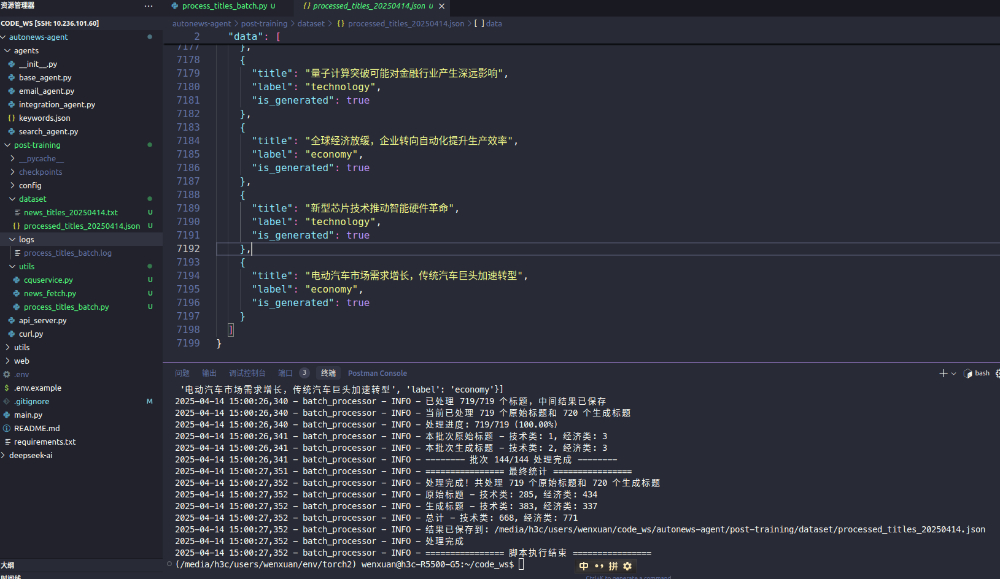

#### 2. 运行LORA微调的finetune_deepseek代码截图（含参数信息）
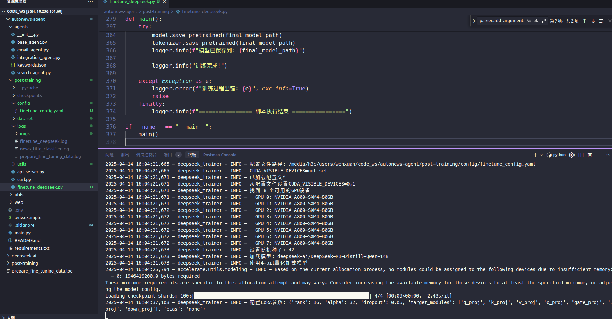

#### 3. 运行finetune_deepseek_gpus.py进行双GPU A800训练开始的截图
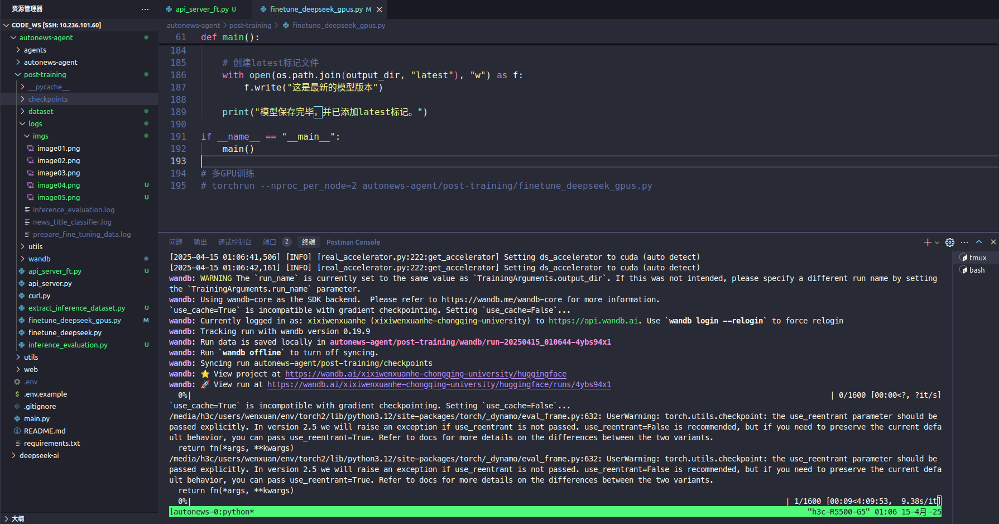

#### 4. 双GPU训练4个小时后的代码结果截图
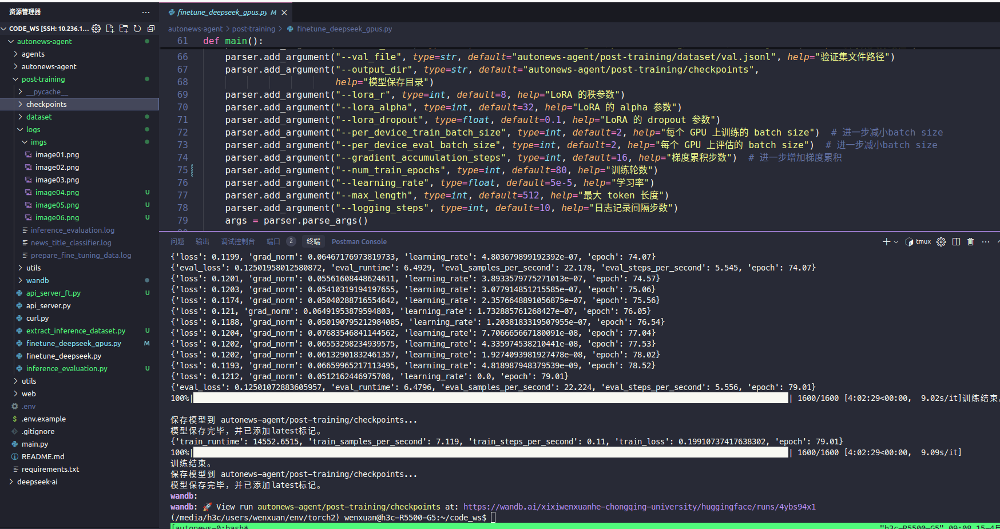

#### 5. Weight&Bias提供的本次训练的配置信息
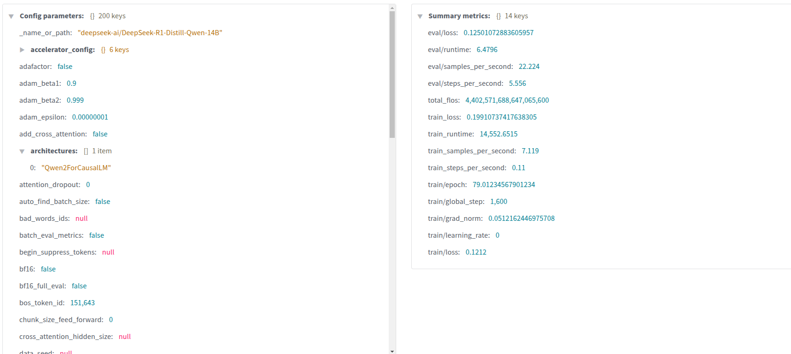

#### 6. 训练过程中的loss、动态学习率可视化（loss从10.7降到0.11）
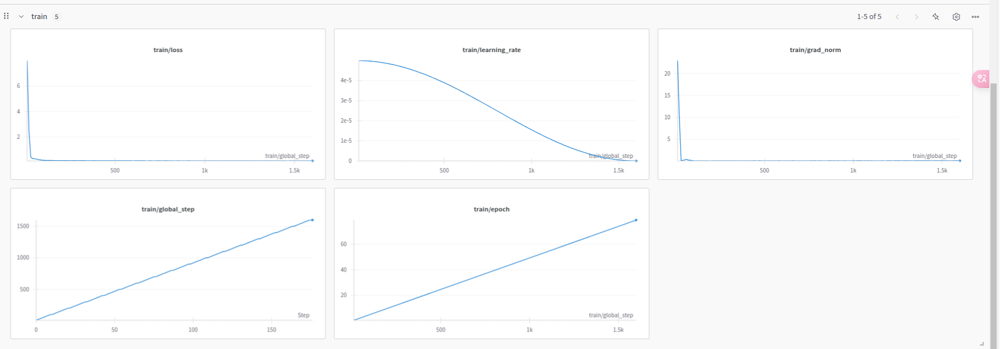

#### 7. eval过程中的loss从0.24下降到0.1，结果达预期，符合理论预测
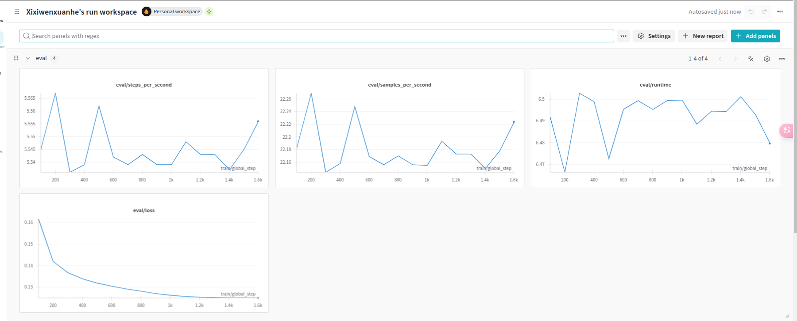

#### 8. 评估微调后模型与原模型的inference_evaluation.py代码截图（2 worker双线程，API推理）
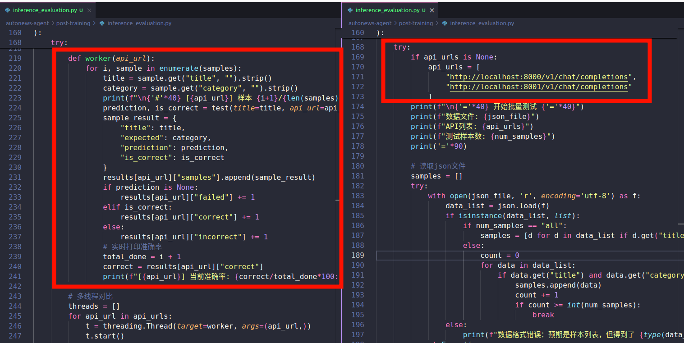

#### 9. 运行inference_evaluation.py的截图（加载LORA，合并权重，直接推理）
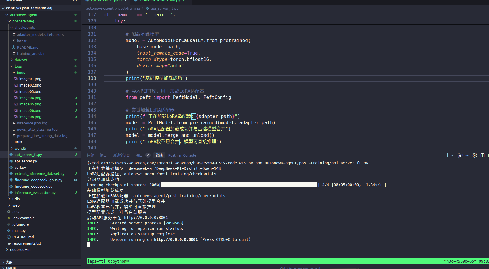

## 进一步展望：多智能体协作 🤖🤝🤖

### MCP + A2A 协作范式 🛠️🔗

在智能体的世界里，单打独斗早就过时啦！现在流行的是——

- **MCP（Multi-Component Planning，多组件规划）🛠️**  
  这就像给所有智能体发了一本"工具说明书"📚，大家都按统一标准用工具。无论是查资料、算数学、发邮件，智能体都能像人类一样灵活调用各种外部工具，谁用得好谁就是"工具王"👑！MCP的精髓就是：**让Agent会用工具，工具越多越强大！**

- **A2A（Agent-to-Agent，智能体间协作）🤝**  
  你有你的绝活，我有我的专长。A2A让智能体们可以互相聊天、分工合作、信息共享，像团队一样完成大任务。遇到难题，大家一起头脑风暴，效率翻倍！

- **MCP+A2A 融合范式 🚀**  
  工具用得溜，伙伴配合好，智能体团队就能无往不利！MCP+A2A结合了统一工具标准和智能体间的高效协作，适合打造超大规模、超强能力的智能体"联盟"⚡。

下面三张图，带你一秒看懂它们的协作关系：

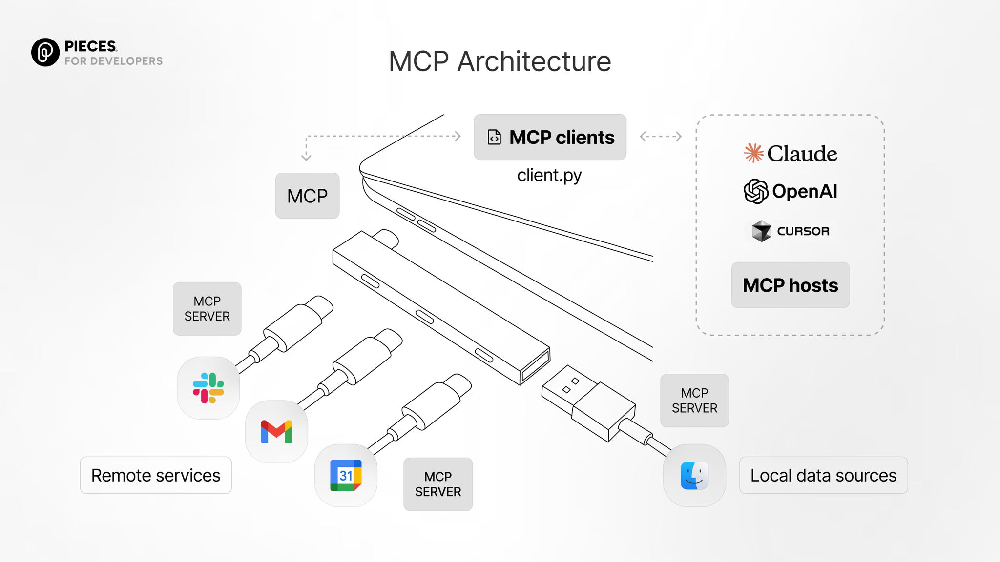
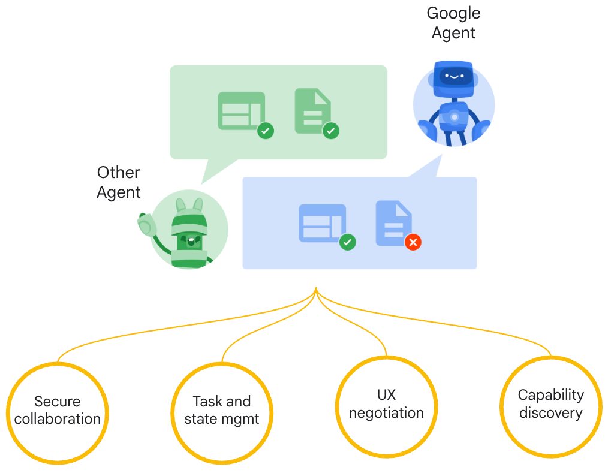
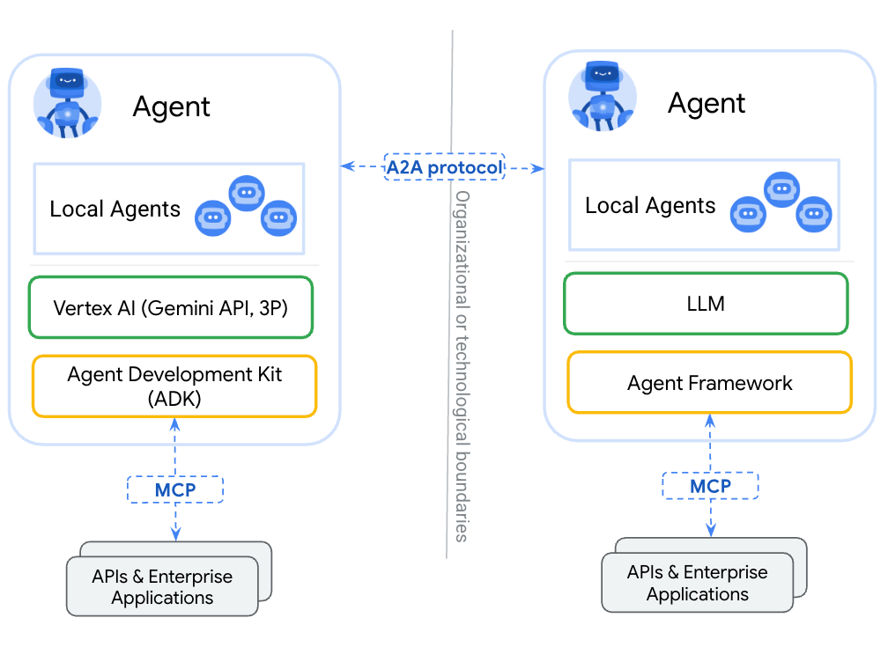

---

### Agent SDK（以OpenAI Agent SDK为例）🧩✨

要让智能体们"组团打怪"，还得有一套好用的"开发神器"——这就是**Agent SDK**！

- **核心思想 🧠**  
  Agent SDK就像是智能体的"万能遥控器🎮"，帮你把每个Agent都标准化、模块化。开发者只管写业务逻辑，通信、调度、工具调用这些"杂事"全都交给SDK自动打理，省心省力！

- **主要功能 🛎️**  
  - 智能体注册与发现：Agent来了就能被"看到"，能力一目了然👀。
  - 工具集成：一行代码接入外部API、数据库、检索引擎，Agent用工具so easy🔌。
  - 消息路由与任务编排：Agent之间消息飞快传递，任务分发井井有条📬。
  - 生命周期与异常管理：Agent出问题？SDK帮你兜底，稳如老狗🦺。

- **应用价值 💡**  
  有了Agent SDK，多智能体系统开发效率up up up，维护扩展so easy，智能体应用"批量生产"不是梦！

来两张图，直观感受OpenAI Agent SDK的核心流程和代码示例：

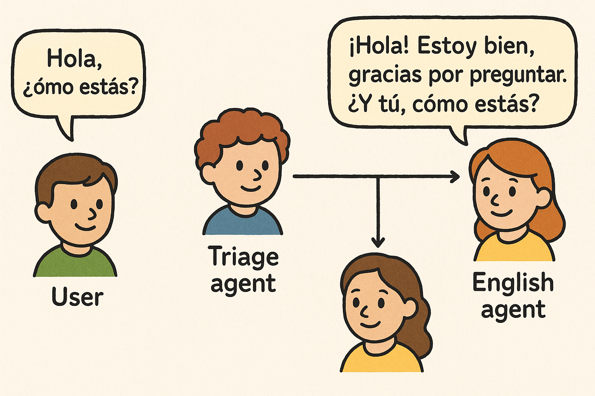
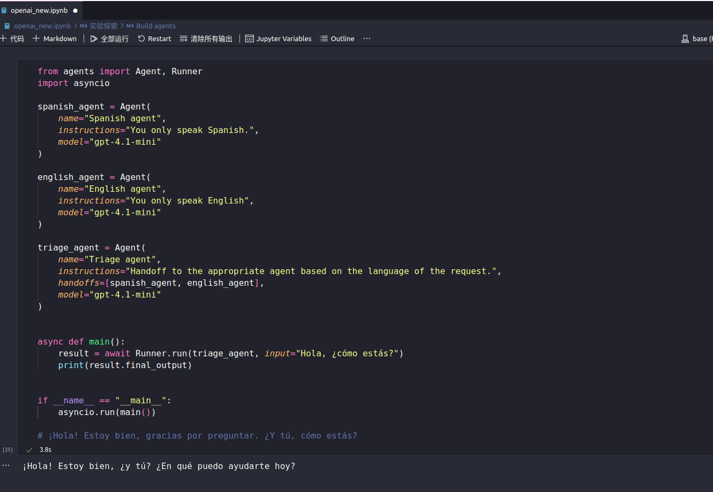

---

如果你想深入了解OpenAI Agent SDK怎么玩，或者想知道怎么和本项目结合，随时来问我吧！😎

## 许可证 📄

[MIT License](LICENSE)


